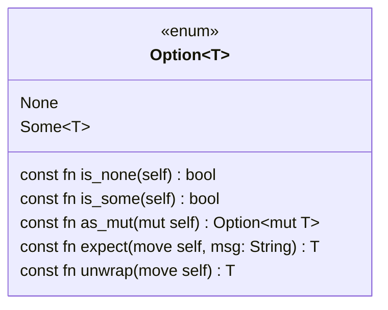

# Option

The `Option` type represents an optional value: every `Option` is either `Some` and contains a value, or `None`, and does not. `Option` types are very common in Rym code, as they have a number of uses:

- Initial values
- Return values for functions that are not defined over their entire input range (partial functions)
- Return value for otherwise reporting simple errors, where None is returned on error
- Optional struct fields
- Struct fields that can be loaned or “taken”
- Optional function arguments
- Nullable pointers
- Swapping things out of difficult situations

`Option`s are commonly paired with pattern matching to query the presence of a value and take action, always accounting for the `None` case.

