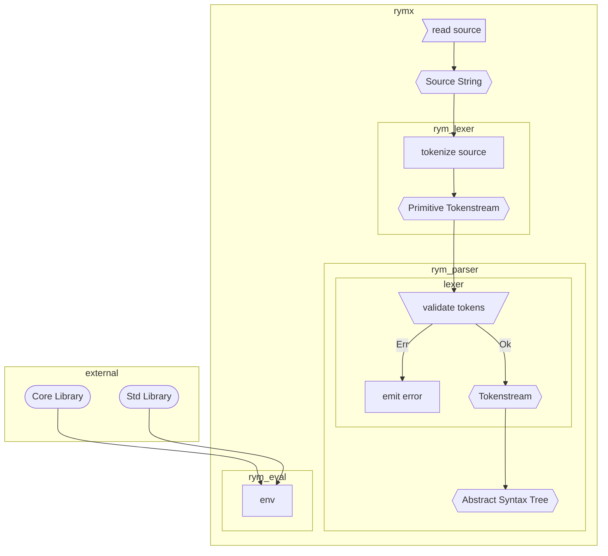

# Documentation

Rym is a modern programming language designed to increase productivity and efficiency. It is expressive, concise, and clean, with a strong focus on simplicity and reliability.

- inspired by Rust, Swift, Python and others
- almost everything is an expression (like in Rust and many functional languages)
- function parameters can be named or positional (works similar to Swift inspired by Python as well)
- semicolons are only required as line terminators when putting multiple statements on one line
- possible side effects of a function (like io, divergence, ffi calls) must be written down i the function definition

<!-- Rym's flexible and modular type system enables you to build programs in a highly organized and scalable way. It is a compiled language that offers fast performance and the convenience of garbage collection, as well as the power of runtime reflection. Rym combines the speed and static typing of a compiled language with the ease and flexibility of a dynamically typed, interpreted language. Whether you are working on a large project or a small one, Rym's features make it a great choice for a wide range of programming tasks.

Rym is a new programming language that combines features from popular languages like Rust, Swift, and Python.
Its key features include the ability to use both named and positional function parameters, the requirement to explicitly specify any potential side effects of a function, semicolons are only required when multiple statements are on one line.
In addition, almost everything in Rym is an expression, allowing for concise and expressive code. Overall, Rym is a powerful and reliable language that is easy to use and understand. -->

## Getting Started

### [Installing Rym](kshgjas)

Instructions for downloading and installing Rym.

## Problems of current and past programming languages

- Parallelization
- (Uncontrolled) Undefined Behaviour
  - https://blog.sigplan.org/2021/11/18/undefined-behavior-deserves-a-better-reputation
- Side Effect Safety, Non local reasoning, Sand Boxing
  - https://www.reddit.com/r/ProgrammingLanguages/comments/9eqrfy/comment/e5s3vhb/?utm_source=share&utm_medium=web2x&context=3
  - Code that we read is not understandable in isolation. For example, taking C++: `call(foo);`, is `foo` modified? Dunno.
    - https://www.reddit.com/r/ProgrammingLanguages/comments/9eqrfy/comment/e5v3vj5/?utm_source=share&utm_medium=web2x&context=3
  - Solved by: Koka
- Cannot rewind time while debugging
  - [Reversible Computation: Extending Horizons of Computing](https://link.springer.com/content/pdf/10.1007/978-3-030-47361-7.pdf)
- Rust solves most of these, but a watered-down version which only loses a bit of efficiency could probably help a lot. [Source](https://www.reddit.com/r/ProgrammingLanguages/comments/9eqrfy/comment/e5v3vj5/?utm_source=share&utm_medium=web2x&context=3) => Basically what Rym tries to be :)

## Problems of new programming languages

- https://www.quora.com/What-are-the-biggest-problems-with-modern-programming-languages?share=1
- There are too many of them
- No innovation
  - Too conservative, offer no real improvement to what came before
  - No clear gain to switch to this language
- Being specific to one problem
  - do interesting thing X but do not advance in all other places

## Qualities of a good programming language

- Good Package Manager
  - https://www.reddit.com/r/ProgrammingLanguages/comments/zqjf47/a_good_dependency_manager_for_a_new_programming/
  - https://futhark-lang.org/blog/2018-07-20-the-future-futhark-package-manager.html

[Programming Language Explorations](https://rtoal.github.io/ple)
