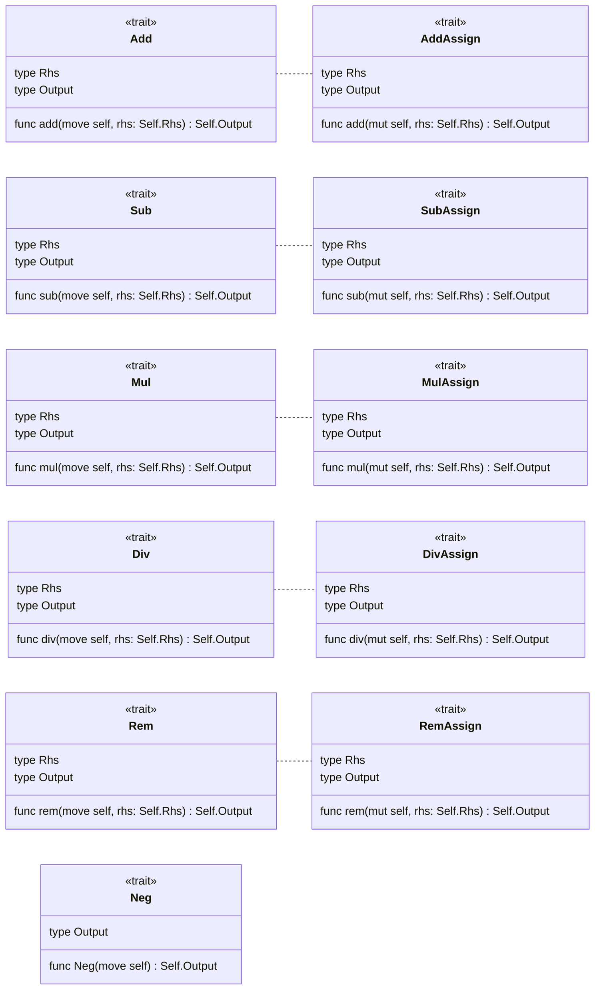

```mermaid
classDiagram
	direction LR

	Add .. AddAssign
	Sub .. SubAssign
	Mul .. MulAssign
	Div .. DivAssign
	Rem .. RemAssign

	class Add {
		<<trait>>
		type Rhs
		type Output
		func add(move self, rhs: Self.Rhs) Self.Output
	}

	class AddAssign {
		<<trait>>
		type Rhs
		type Output
		func add(mut self, rhs: Self.Rhs) Self.Output
	}

	class Sub {
		<<trait>>
		type Rhs
		type Output
		func sub(move self, rhs: Self.Rhs) Self.Output
	}

	class SubAssign {
		<<trait>>
		type Rhs
		type Output
		func sub(mut self, rhs: Self.Rhs) Self.Output
	}

	class Mul {
		<<trait>>
		type Rhs
		type Output
		func mul(move self, rhs: Self.Rhs) Self.Output
	}

	class MulAssign {
		<<trait>>
		type Rhs
		type Output
		func mul(mut self, rhs: Self.Rhs) Self.Output
	}

	class Div {
		<<trait>>
		type Rhs
		type Output
		func div(move self, rhs: Self.Rhs) Self.Output
	}

	class DivAssign {
		<<trait>>
		type Rhs
		type Output
		func div(mut self, rhs: Self.Rhs) Self.Output
	}

	class Rem {
		<<trait>>
		type Rhs
		type Output
		func rem(move self, rhs: Self.Rhs) Self.Output
	}

	class RemAssign {
		<<trait>>
		type Rhs
		type Output
		func rem(mut self, rhs: Self.Rhs) Self.Output
	}

	class Neg {
		<<trait>>
		type Output
		func Neg(move self) Self.Output
	}
```
